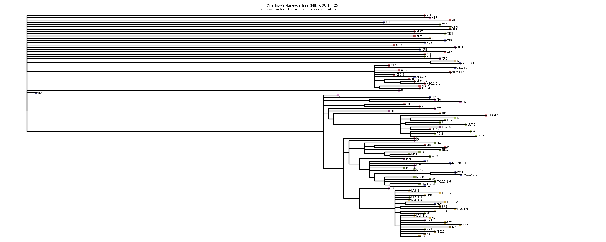
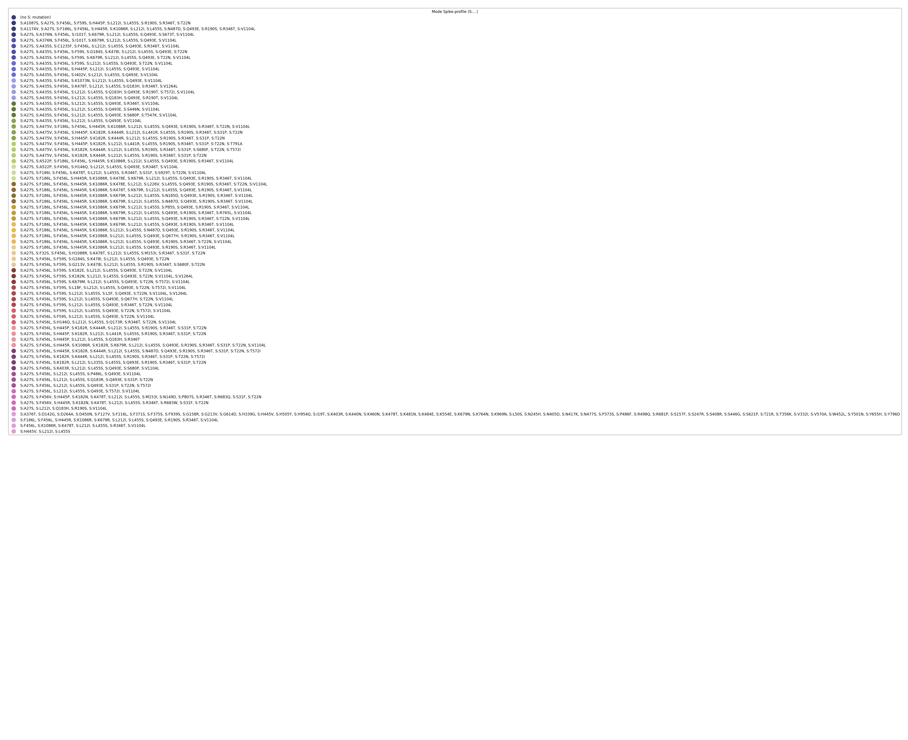

# COVID_spike

A repository for generating and visualizing a SARS-CoV-2 Spike-profile phylogenetic tree from “April + May 2025” sequences.  

---

## 📂 Output Files

- **Spike tree** (PNG):  
  `nextclade_output_april_may/lineage_tree_dots_fallback.png`  
  

- **Spike legend** (PNG):  
  `nextclade_output_april_may/spike_legend.png`  
  

---

## 🔬 Overview

We built a “spike‐profile” tree showing one representative per collapsed Pango lineage, colored by shared Spike mutations. All sequences were collected in April and May 2025.

1. **Data sources**  
   - GISAID nucleic acid FASTA for April 2025  
   - GISAID nucleic acid FASTA for May 2025  

2. **Key steps**  
   1. Merge April + May FASTA  
   2. Run Nextclade (BA.2.86 reference) → generate alignment + QC + Pango calls  
   3. Prune out low-quality sequences (keeping only “good” Nextclade QC)  
   4. Collapse low-frequency sublineages into their nearest “common” parent (≥ 50 genomes)  
   5. Pick a single representative per collapsed lineage (mode Spike-profile)  
   6. Prune the Nextclade‐generated Newick tree to those representatives  
   7. Draw the pruned tree with Biopython; overlay a colored dot at each tip to indicate its Spike-profile set  
   8. Save:  
      - Tree with dots (PDF + PNG)  
      - Separate legend mapping each color to its Spike-profile (PDF + PNG)  

---

## ⚙️ Method

These instructions reproduce the “Spike tree” for April + May 2025 sequences.

### 1. Merge April + May FASTA

```bash
# Combine the April and May GISAID FASTA files into one:
cat gisaid_april.fasta gisaid_may.fasta > gisaid_april_may.fasta
